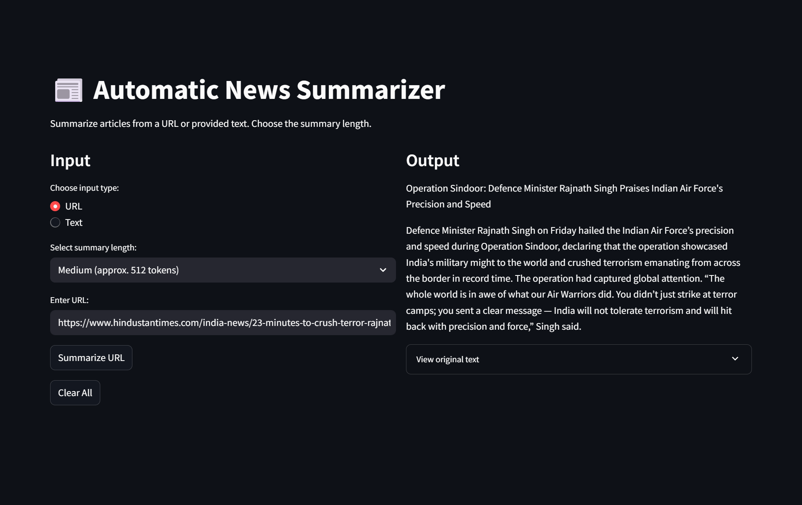

# 📰 Automatic News Summarizer

This repository hosts a project titled **Automatic News Summarizer**. The primary goal of this project is to automatically generate summaries of news articles using a custom-trained model deployed on Hugging Face.

## 🔍 Overview

The **Automatic News Summarizer** notebook is the main public-facing tool in this repository. It leverages a custom Hugging Face model (integrated via the notebook) to perform natural language summarization.

## 📁 Files in this Repository

- `automatic news summarizer.ipynb`  
  The main summarization notebook. It uses a custom model hosted on Hugging Face to generate summaries from news articles provided as URLs or plain text.

- `final_project.ipynb`  
  A development-phase notebook containing exploratory work and model tuning steps. Useful for understanding the project's evolution.

- `final_project_necessary_parts.ipynb`  
  A minimal and clean version of the core summarization logic, ideal for learning or integrating the summarization pipeline elsewhere.

## 🤖 Model Deployment

The summarization model is hosted on [Hugging Face](https://huggingface.co/) under the name `unsloth/Llama-3.2-3B-Instruct`. It is integrated in the notebook using the `unsloth` library and `FastLanguageModel` for fast, memory-efficient inference.

## 📌 Usage

To use this project:

1. Clone this repository.
2. Open the `automatic news summarizer.ipynb` notebook in Jupyter or Google Colab.
3. Input a news article URL or paste custom text.
4. Choose a summary length (Short, Medium, Long) and run the notebook.

## 🛠 Requirements

Install required Python packages using:

```bash
pip install unsloth streamlit transformers beautifulsoup4 newspaper3k torch
```

## 🌐 Local Deployment

run the app locally using Streamlit and LocalTunnel:

```bash
streamlit run app.py
npx localtunnel --port 8501
```

## Interface Demo

## 🖼 Interface Demo

Here's a quick look at the interface:



You can choose input type, select summary length, enter a URL or text, and view the generated summary alongside the original article.

